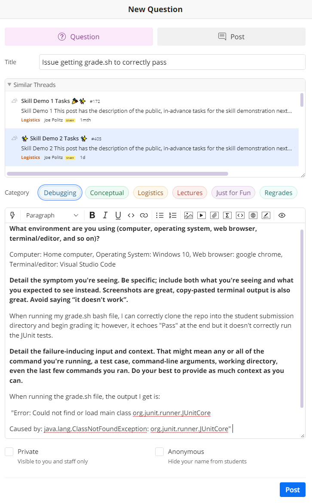
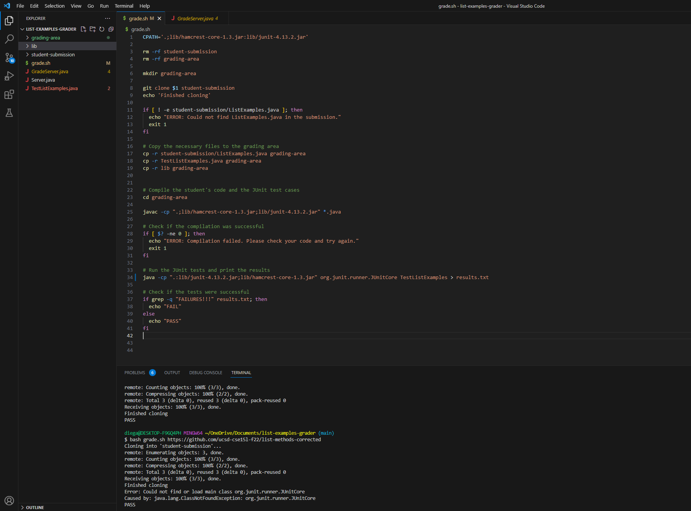
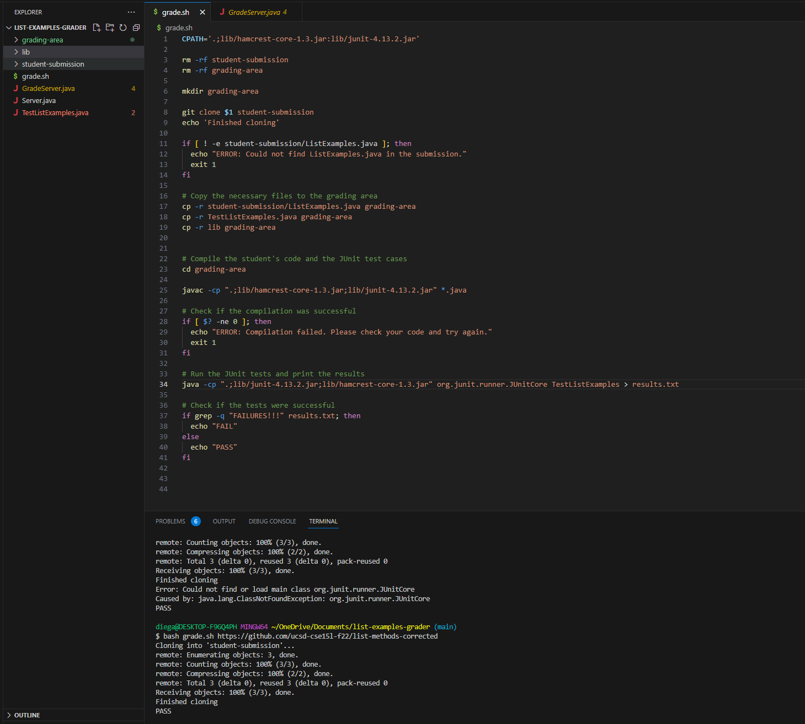

Question:
=========

TA/Staff Response:
==================

Answer: I see that you're having issues with the compiling of your JUnit class. Assuming that the lib folder is in the same directory as your grade.sh file, 
what is the command within the bash file that is being used to compile? I noticed that your operating system is Windows based and a common bug found with the 
Windows systems is the compiling of the JUnit class. 

Student Reply:
==============

When attempting to run the bash file, I this error in the terminal. Included in the screenshot is the diretories being used and the contents of the bash.sh file being used to grade the ListExamples.java files.

TA/Staff Response:
==================
Answer: Like I mentioned earlier, I can see that the issue could be caused by how you're compiling the JUnit. You can try changing line 34 of your grade.sh bash file, to being:
java -cp ".;lib/junit-4.13.2.jar;lib/hamcrest-core-1.3.jar" org.junit.runner.JUnitCore TestListExamples > results.txt
The difference being the semicolon before "lib" instead of the colon. 

Student Reply:
==============

It works! I changed the colon to the semi as you advised me to do so, and now the grade.sh file is correctly grading the filee, thank you so much for the help!!

The Bug:
========

The bug that the student was experiencing was a simple typo in how JUnit was being compiled. In Mac based systems, it can be compiled using a colon before "lib"; however, in 
windows based systems, a semi-colon is used. Upon modifying the grade.sh file and changing the colon to the semicolon, the bash file correctly grades the student submission. The lib 
directory which has the JUnit class was in the same directory as the grade.sh so that did not cause any issues with the bash file. The command line argument that was being used 
is shown in the screenshots, but once again, they were just passing an argument (Repo URL) into the grade.sh file to grade a student submission. Command: `bash grade.sh https://github.com/ucsd-cse15l-f22/list-methods-corrected`

Part 2: Reflection
==================

This course and its labs definitely strengthened my knowledge primarily in debugging and correctly approaching the process of it. I always saw debugging as a black and white process; however, I can now see that many
different issues can be working togethter to cause a fatal bug. Learning the difference between something as simple as a "symptom" and a "bug" really showed me that I was very naive with the whole process. I am aware that 
many of the bugs that I have encountered have been an easy fix, for the most part, but getting familiar and comfortable with identify possible symptoms and their root causes can allow me to find bugs and fix them far more swiftly
than I ever would if I hadn't taken this class. The lab sections have been really informative and quite interactive! I never thought that debugging could be a good stress relief but I guess that only works when the bug is an easy fix!
